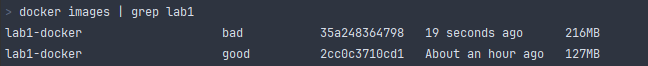
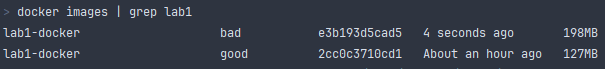

# Lab 1, ITMO, DevOps

## Part 1.1 - Bad & Good Dockerfile's

### Описание запуска

В данном задании для тестирования сборок на основе `Dockerfile` было написано простое `python` веб-приложение с использованием библиотеки `[FastAPI + Uvicorn](https://fastapi.tiangolo.com/)`,
менеджер зависимостей приложения производится с помощью `[pdm](https://pdm-project.org/latest/)`.

Для сборки контейнеров необходимо выполнить следующие команды:

- `make docker-run-bad` - для сборки на основе плохого `Dockerfile` (`docker/Dockerfile-bad`)
- `make docker-run-good` - для сборки на основе хорошего `Dockerfile` (`docker/Dockerfile`)

Разберём, какие `bad-practices` были использованы в плохом `Dockerfile` и как они были исправлены.

### Bad Practices - Bad vs Good Dockerfile

Итак, перейдём к описанию `bad practices`, будем говорить о них в порядке прохождения по файлу сверху вниз:

1. `1:FROM python:3.10-slim-buster as builder` - данная строка в `Dockerfile-bad` говорит о том, какой `python` образ мы будем устанавливать. Тут уже можно ошибиться, выбирая
не самый оптимальный по размеру образ (например `python3.10` весит почти `1Gb` и в нём есть огромное количество ненужных в `production` зависимостей (например, `git`)). Однако в данном примере образ
выставлен минимальный по размеру, однако он зафиксирован внутри `Dockerfile` и этом может привести к неудобству в переопределении (например, мы захотим другую версию `python`). Поэтому 
правильнее указывать в качестве `--build-arg`, какую версию `python` или его образа мы бы хотели устанавливать. Это реализовано в хорошем `Dockerfile` следующим образом:

     ```dockerfile
     ARG PYTHON_BASE_VERSION=3.10

     FROM python:${PYTHON_BASE_VERSION}-slim-buster as base_downloader
     ```

2. `4:RUN apt-get update && apt-get install -y curl` - в данной строке происходит установка зависимости `curl`, которая необходима в дальнейшем для установки
корректным образом менеджера зависимости `pdm`. Здесь можно заметить две `Bad Practices`: во-первых, данную строчку очень тяжело читать и подобные длинные строки должны быть разделены знаком `/`, это сказано
в официальной документации [`docker`](https://docs.docker.com/develop/develop-images/guidelines/#sort-multi-line-arguments), а во-вторых, хорошей практикой для уменьшения
размера образа является чистка от дополнительных зависимостей, которые происходят при установке каких-то библиотек (так, например, команда apt-get update и install тянет очень много кешей, которые не будут использованы в проде,
поэтому их нужно [удалить](https://docs.docker.com/develop/develop-images/guidelines/#leverage-build-cache)). В хорошем `Dockerfile` это исправлено следующим образом:

     ```dockerfile
     RUN apt-get update && \
         apt-get install -y curl && \
         apt-get clean && \
         rm -rf /var/lib/apt/lists/*
     ```
   
3. `7:COPY . .` - данная строчка в `Dockerfile-bad` копирует всё имеющееся содержимое из локальной директории внутрь контейнера, однако в данной безобидной команде могут таиться `bad practices`:

     3.1 Во-первых, эта операция опасна увеличением размера dockerfile, потому что копироваться будет абсолютно все из директории - и папка `.git`, и скрытые файлы `.env`. Этого можно избежать, если существует файл [`.dockerignore`](https://docs.docker.com/develop/develop-images/guidelines/#exclude-with-dockerignore), как это и сделано в задании, однако так команду лучше не использовать и указывать только необходимые директории/файлы, которые будут использоваться в финальной версии `Dockerfile`;
     3.2 Во-вторых, существуют ещё один `Bad Practices`, а именно данный слой контейнера расположен слишком рано. Существует официальное правило, согласно которому слои в `Dockerfile` нужно располагать таким образом, чтобы наиболее изменяемые части кода (например, сам код `web`-приложения будет изменяться чаще других файлов) находились позже всех остальных слоёв, так как при изменении верхнего слоя теряются кэши всех предыдущих слоёв в `Dockerfile` и сборка производится заново!

     Эти две `Bad Practices` были исправлены в хорошем `Dockerfile`, путём добавления в конец `Dockerfile` операции COPY кода приложения: `COPY src/ src/`

4. В плохом `dockerfile` после копирования происходит установка зависимостей приложения:

     ```dockerfile
     RUN pdm install --global --project /project
     RUN pdm cache clear
     ```
   
     В этом пункте опять можно найти две `bad practice`:  во-первых, основным правилом является минимизация количества слоёв в `Dockerfile`, поэтому данную команду можно выполнить в одном слое, используя `\`, а во-вторых тут присутствует `bad practice` из разработки - устанавливаются не только `prod` зависимости, но и `test`, а они в проде не нужны!

     Исправлено это в хорошем `dockerfile` с помощью следующей команды: `pdm sync --prod --no-editable`

5. Мы перешли к самой большой проблеме плохого `Dockerfile` - отсутствие [`Multi-Stage Building`](https://docs.docker.com/develop/develop-images/guidelines/#leverage-build-cache) и установка приложений, которые не понадобятся в `production` ([`unnessary apps`](https://docs.docker.com/develop/develop-images/guidelines/#dont-install-unnecessary-packages)).

Опишем на примере - например, в плохом `Dockerfile` устанавливаются утилиты `curl` для установки `pdm`, затем устанавливается сам `pdm`, но эти все утилиты являются лишь подготовлением к запуску приложения и в проде не нужны!

Для исправления данной ошибки был построен хороший файл из четырёх `stages`, а именно:

- `4:base_downloader` - устанавливает утилиту `curl`
- `12:FROM base_downloader AS pdm_downloader` - копирует утилиту `curl` из прошлого `stage` и устанавливает `pdm`
- `19:FROM pdm_downloader as pdm_builder` - копирует утилиту `pdm`, файлы для установки зависимостей `pyproject.toml` и `pdm.lock` и устанавливает библиотеку в папку `/project/`
- `30:python:${PYTHON_BASE_VERSION}-slim-buster` - финальный образ: копирует установленные библиотеки из образа `pdm_builder`, копирует код и запускает приложение

С использованием `MultiStage`-сборки `Dockerfile` можно посмотреть на разницу на размеры полученных собранных контейнеров:



Даже если добавить удаление ненужных кэшей в пунтке 2, то разница в `70MB` - весьма ощутимо:



В хорошем `dockerfile` в принципе тоже можно найти несколько `bad practices` - например, непараметризация `port`-а, на котором слушается приложение, или отсутствие команды `EXPOSE <PORT`, однако он собран явно лучше и оптимальнее, чем его предшественник - плохой `dockerfile`.

Первое задание выполнено!