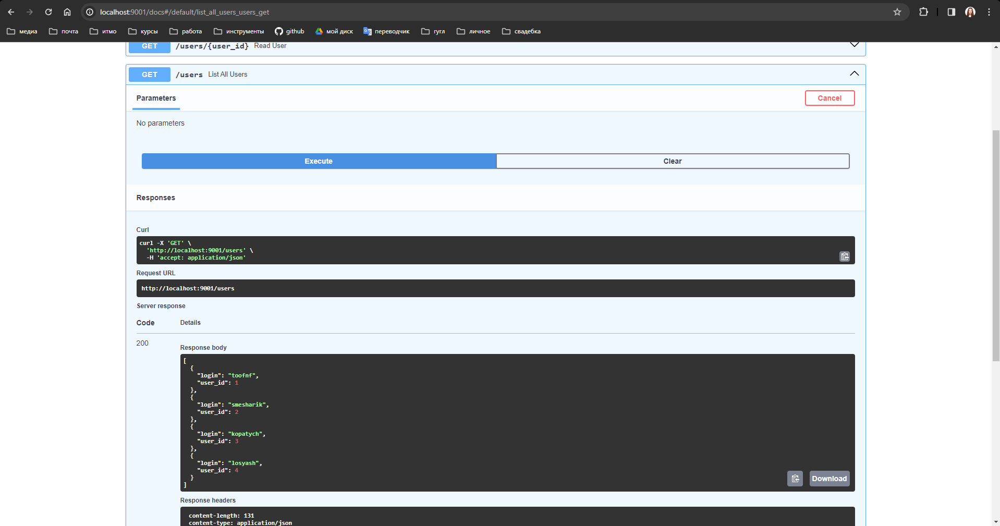

# Lab 1* - Web + Database

## Описание задания

Приложение в запущенном контейнере должно записывать изменения в базу данных.

Что именно записать – передаётся в команде запуска контейнера. При остановке контейнера информация не должна исчезать.

Файл должен иметь название, отличное от Dockerfile. (то есть докер файл должен называться не Dockerfile). (вдогонку заданию про докер)

## Решение

В данном задании было реализовано простое web-приложение, которое умееет создавать новых пользователей с заданным логином, а также показывать список всех доступных пользователей.
Данные пользователи хранятся в базе данных `PostgreSQL`.

Для одновременного запуска web-приложения и базы данных был написан `./docker-compose.yml` файл:

```yaml
version: "3.9"
services:
  app-web-app:
    build:
      dockerfile: ./docker/Dockerfile_app
      args:
        - PYTHON_BASE_VERSION=3.10
    env_file:
      - .env
    environment:
      - POSTGRES_HOST=db
      - POSTGRES_PORT=5432
    depends_on:
      db:
        condition: service_healthy
    pid: "host"
    privileged: true
    container_name: my-web-app
    security_opt:
      - no-new-privileges:true
    restart: always
    ports:
      - "9001:9001"

  db:
    image: postgres:13.4-alpine3.14
    container_name: postgres-production-db
    volumes:
      - "ps:/var/lib/postgresql/data"
    env_file:
      - .env
    healthcheck:
      test: ["CMD-SHELL", "pg_isready -U postgres"]
      interval: 1s
      timeout: 1s
      retries: 30
    ports:
      - "9002:5432"

volumes:
  ps:
```

В данном файле описано веб-приложение `app-web-app`, собираемое из файла `./docker/Dockerfile_app` и запускающееся на порту `9001`. Данное приложение не стартанётся без
базы данных `db` (`postgres`), которое запустится тогда, когда сработает `healhcheck`. Консинстетность данных же от запуска к запуску контейнеров происходит благодаря созданному вольюму `ps`, находящемуся в локальной папке - при новом запуске контейнер `db` заглянет в неё и подтянет сохраненную базу данных, поэтому мы не боимся потерять данные после погашения контейнера.

Для запуска полного приложения необходимо выполнить следующую команду:

```
docker-compose up --build
```

Посмотрим на реализованный функционал API приложения. Во-первых, можно создать пользователя:


А ещё можно посмотреть список всех пользователей:



Проверим, что данные действительно хранятся в postgresql. Для этого успешно к ней подключимся с локального компьютера:


А затем посмотрим, что хранится в таблице `users` - совпадает с результатом запроса к `api` сервису:


Продемонстрируем последнее необходимое поведение - сохранение данных при погашении контейнера. Погасим оба контейнера:


А затем поднимем их  и сделаем запрос к API - результат, как видно на рисунке, сохранился и пользователи сохранились в базе данных:


Лабораторная работа выполнена!