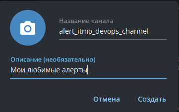
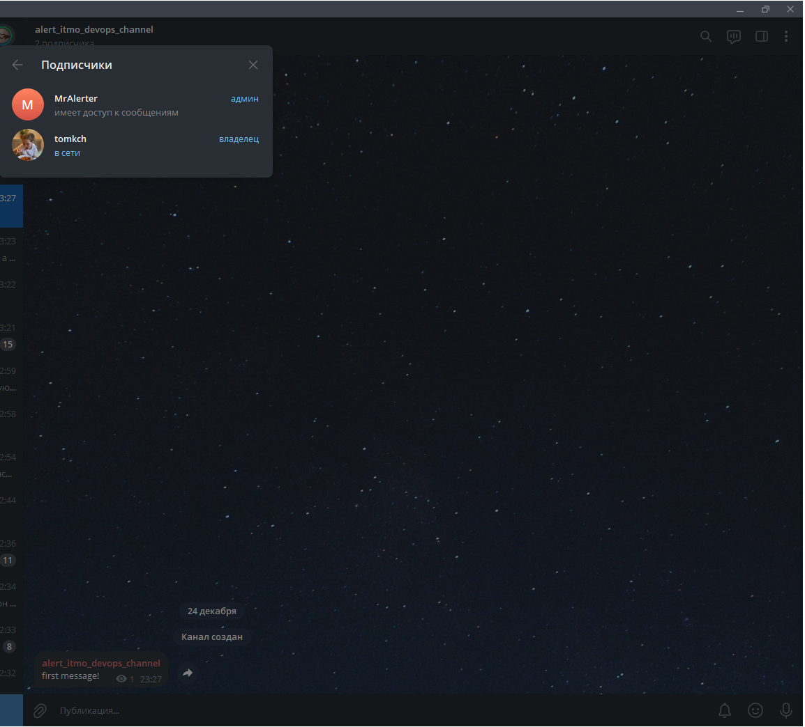
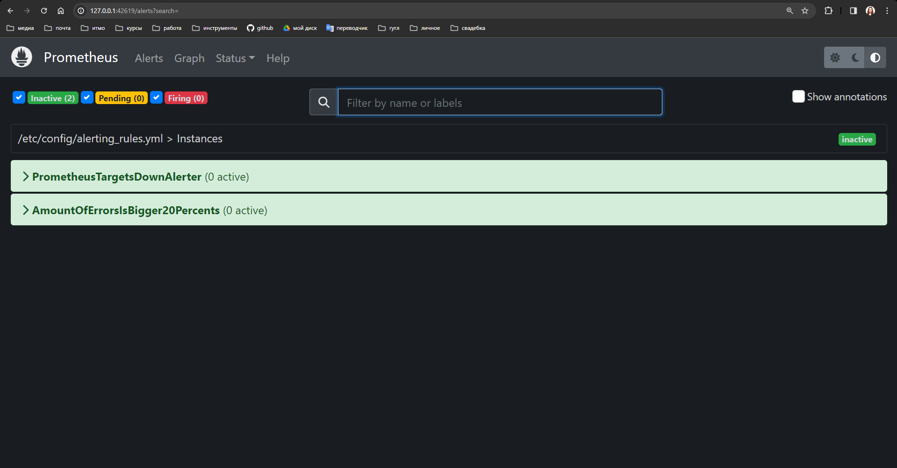
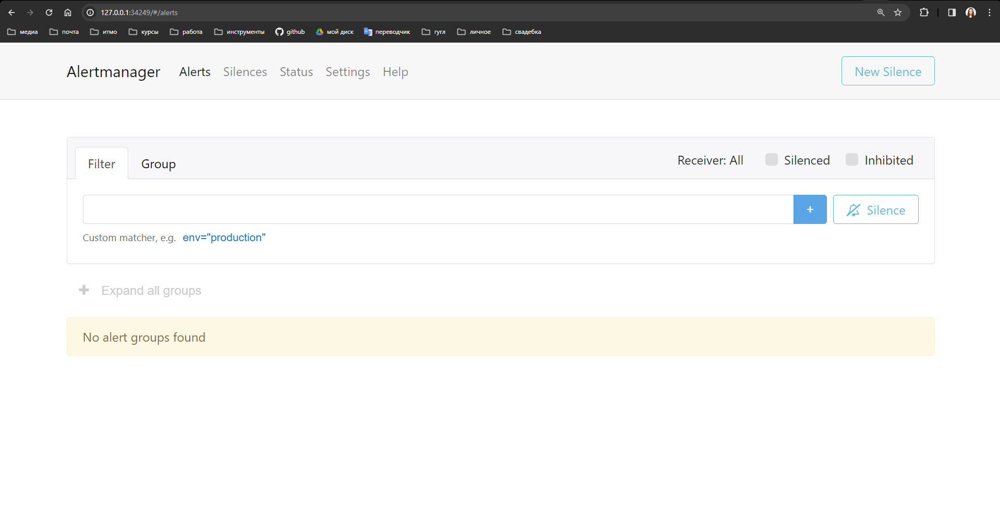
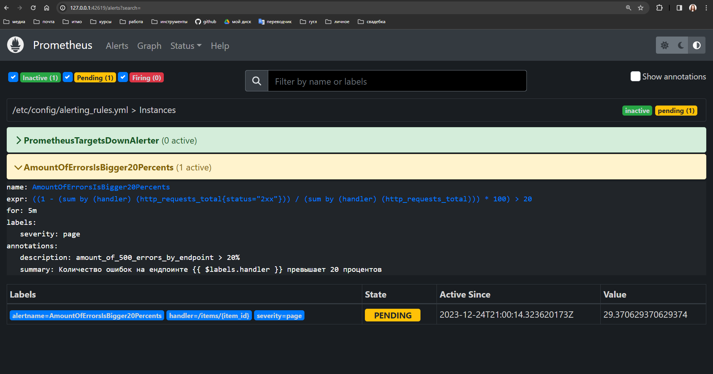
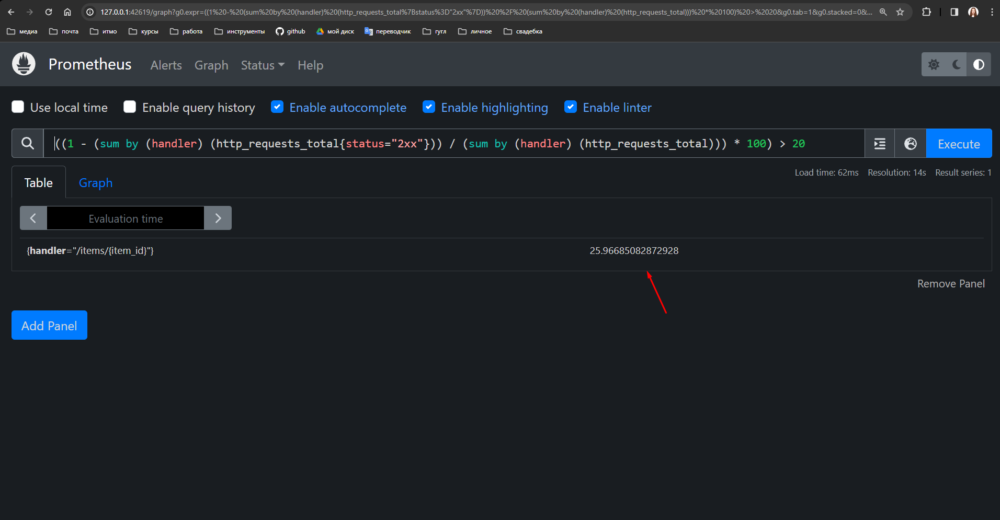
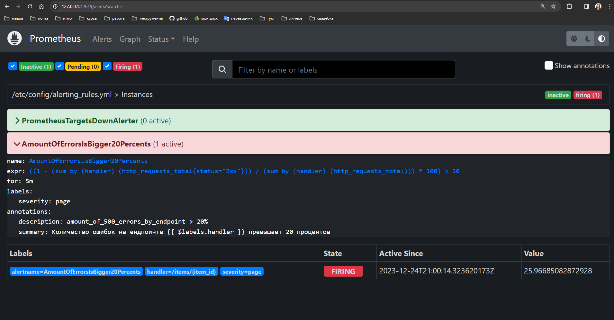
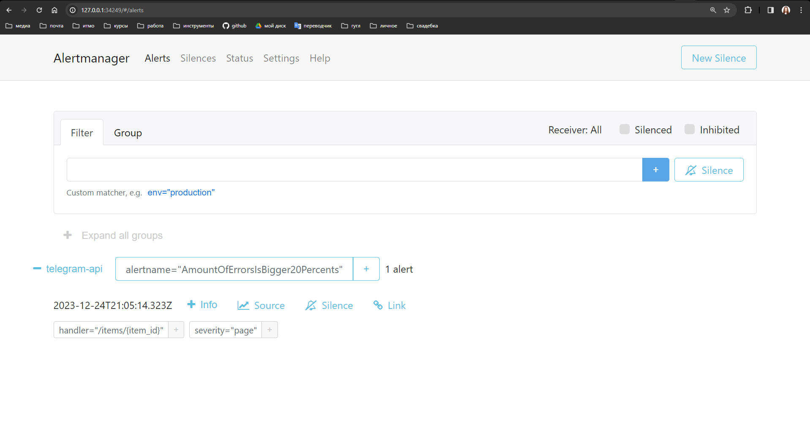
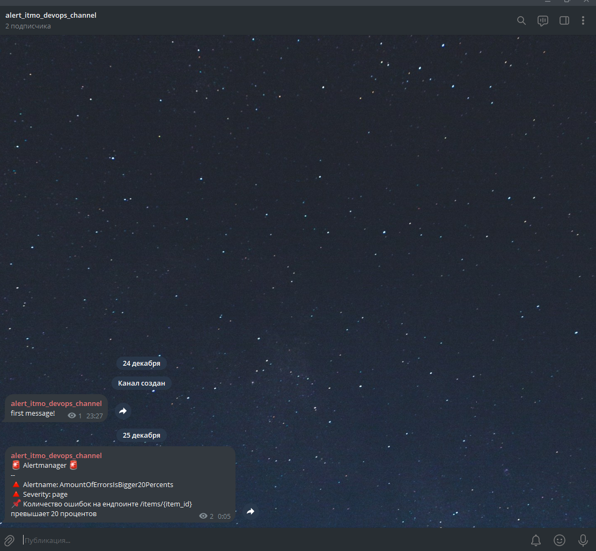

# Lab 4* - Custom Alerting

## Описание задания

Настроить алерт кодом (не в интерфейсе графаны:), показать пример его срабатывания. 

Попробовать сделать так, чтобы он приходил, например, на почту или в телеграм. 

Если не получится - показать имеющийся результат и аргументировать, почему дальше невозможно реализовать. 

Вдогонку задания про мониторинг.

## Решение

Для решения данной задачи глобально нужно сделать три вещи:
- создать телеграм-бота, который будет отсылать алерты в канал
- задать правила, по которым будут срабатывать алерты
- задать конфиг alertmanager-а так, чтобы в созданный канал ботом отсылались алерты и уведомления

Разберём подробнее каждый пункт

### Telegram Bot

Для создания telegram-бота воспользуемся очень удобной [инструкцией](https://gist.github.com/ilap/cb6d512694c3e4f2427f85e4caec8ad7), а именно:

1. Создадим бота с помощью команды `/newbot` в чате с [@BotFather](https://t.me/BotFather)

    

2. Далее создадим канал в телеграме и пригласим туда нашего бота `alert_devops_itmo_bot`

    

3. Далее по инструкции нам нужно узнать `id` чата, в который нужно писать боту - авторы предлагают написать одно сообщение в чате и перейти по ссылке: `https://api.telegram.org/bot<YOUR API TOKE FROM ABOVE>/getUpdates`. Получилось определить id чата (оно закрашено на риснуке под ключом `id`)!

    

    

Для телеграм бота всё готово

### Alert Rules

Будем использовать конфиг [Alert Rules](https://prometheus.io/docs/prometheus/latest/configuration/alerting_rules/), который предоставляет нам документация prometheus.

Для добавления правил, по которым будут срабатывать алерты, добавим в файл `./charts/prometheus/values.yml` соответствующие строки:

```yaml
serverFiles:
  ## Alerts configuration
  ## Ref: https://prometheus.io/docs/prometheus/latest/configuration/alerting_rules/
  alerting_rules.yml:
    groups:
      - name: "Instances"
        rules:
          - alert: PrometheusTargetsDownAlerter
            expr: up == 0
            for: 20s
            labels:
              severity: warning
            annotations:
              summary: "Prometheus target {{ $labels.instance }} down"
              description: "{{ $labels.instance }} of job {{ $labels.job }} has been down for more than 20s"
          - alert: AmountOfErrorsIsBigger20Percents
            expr: ((1 - (sum(http_requests_total{status='2xx'}) by (handler)) / (sum(http_requests_total) by (handler))) * 100) > 20
            for: 5m
            labels:
              severity: page
            annotations:
              summary: "Количество ошибок на ендпоинте {{ $labels.handler }} превышает 20 процентов"
              description: "amount_of_500_errors_by_endpoint > 20%"
  prometheus.yml:
    alerting:
      alertmanagers:
        - kubernetes_sd_configs:
            - role: pod
          tls_config:
            ca_file: /var/run/secrets/kubernetes.io/serviceaccount/ca.crt
          bearer_token_file: /var/run/secrets/kubernetes.io/serviceaccount/token
          relabel_configs:
            - source_labels: [ __meta_kubernetes_namespace ]
              regex: default
              action: keep
            - source_labels: [ __meta_kubernetes_pod_label_app_kubernetes_io_instance ]
              regex: prometheus-alertmanager
              action: keep
            - source_labels: [ __meta_kubernetes_pod_label_app_kubernetes_io_name ]
              regex: alertmanager
              action: keep
            - source_labels: [ __meta_kubernetes_pod_container_port_number ]
              regex: "9093"
              action: keep
alertmanager:
  ## If false, alertmanager will not be installed
  ##
  enabled: false

```

В данном случае добавлены два правила - первое правило отвечает за то, что `prometheus`-у доступны все таргеты для сбора данных, второе же правило знакомо нам по 4-ой лабораторной - будем мониторить и алертить, если количество ошибок по какой-то ручке превышает 20% от общего числа запросов.
Также был добавлен конфиг `alerting` в файле `prometheus.yml`, в котором описано в какой же инстанс alertmanager-а отправлять алерты. Последнее же изменение связано с тем, что мы не будем устанавливать `alertmanager` через чарт `prometheus`-а, а установим его отдельным чартом.

Поднимем рели `prometheus`-а заново с помощью команды:

```yaml
helm install prometheus prometheus-community/prometheus -f ./charts/prometheus/values.yml
```

Видим, что во вкладке Alerts появились два правила, которые мы задали - и они находятся в состоянии `Inactive`



### AlertManager Config

Теперь изменим [конфиг](https://prometheus.io/docs/alerting/latest/configuration/) `alertmanager` - для начала скачаем чарт и разместим дефолтные `values.yml`:

```bash
helm show values prometheus-community/alertmanager > ./charts/alertmanager/values.yml
```

Единственное, что нужно сделать - добавить в нужное место настройку [telegram config](https://prometheus.io/docs/alerting/latest/configuration/#telegram_config) для нашего только что созданного бота и чата в файл `./charts/alertmanager/values.yml`:

```
config:
  enabled: true
  global: {}
    # slack_api_url: ''

  templates:
    - '/etc/alertmanager/*.tmpl'

  receivers:
    - name: 'telegram-api'
      telegram_configs:
      - bot_token: <BOT_TOKEN>
        api_url: https://api.telegram.org
        chat_id: <CHAT_ID>
        parse_mode: ''
        message: "🚨 Alertmanager 🚨\n--\n🔺 Alertname: {{ .GroupLabels.alertname}}\n🔺 Severity: {{ .CommonLabels.severity }}\n📌 {{ range .Alerts }}{{ .Annotations.summary }}\n{{ end }}"
      # slack_configs:
      #  - channel: '@you'
      #    send_resolved: true

  route:
    group_by: [ 'alertname' ]
    group_wait: 10s
    group_interval: 10s
    repeat_interval: 5m
    receiver: 'telegram-api'
```

Единственное, что нужно сделать - вставить скрытые `<BOT_TOKEN>` и `<CHAT_ID>` в данный конфиг.

Установим релиз `alertmanager`:

```bash
helm install prometheus-alertmanager prometheus-community/alertmanager -f ./charts/alertmanager/values.yml
```

Поднялся сервис `alertmanager`-а и здесь мы ожидаем увидеть алерты:



### Срабатывание алерта

Добьёмся срабатывания алерта по правилу `AmountOfErrorsIsBigger20Percents` - для этого нагрузим наш сервис, который, как известно из лабораторной 4, падает с вероятностью 25%, поэтому данный алерт будет достигнут путём нагрузочного тестирования.

Спустя время мы видим, что алерт из статуса `Inactive` перешёл в статус `Pending`:



Статус действительно поменялся верно - метрика больше 20 процентов (25):



А ещё спустя время перенёсся в статус `Failed` (за некоторый промежуток время данная метрика не вернулась к нормальным значениями):



Также данный алерт появился и на сервисе `alertmanager`, и в телеграм канале, а значит данная лабораторная работа выполнена!



