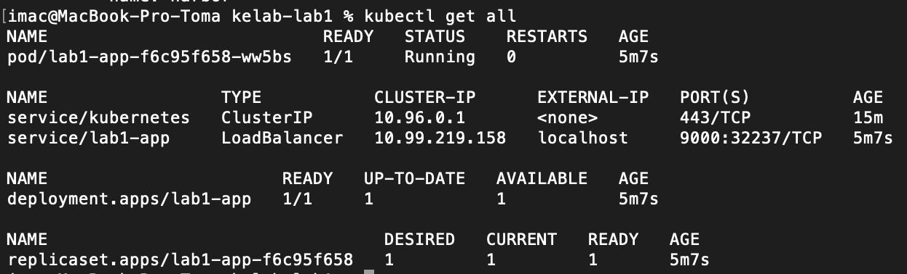
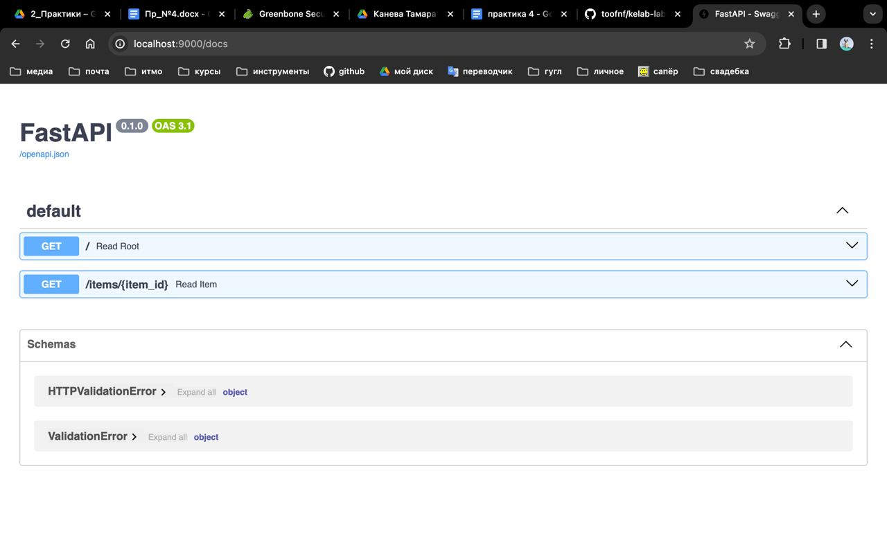

# Kubectl Deployment

Для выполнения данного задания был скачан на MacOS систему `docker` и внутри поставляемый `kubernetes` и создан следующий файл `app.yaml`:

```yaml
apiVersion: v1
kind: Service
metadata:
  name: lab1-app
spec:
  selector:
    app: lab1-app
  ports:
  - protocol: "TCP"
    port: 9000
    targetPort: 9000
  type: LoadBalancer

---
apiVersion: apps/v1
kind: Deployment
metadata:
  name: lab1-app
spec:
  selector:
    matchLabels:
      app: lab1-app
  replicas: 1
  template:
    metadata:
      labels:
        app: lab1-app
    spec:
      containers:
      - name: lab1-app
        image: lab1-docker:good
        imagePullPolicy: Never
        ports:
        - containerPort: 9000
```

В данном файле описаны следующие абстракции:

- `Deployment` - абстракция высокого уровня, который позволяет добавлять возможность обновления управляемых `Pods` в количестве `replicas=1`;
- `Pod` - описан в `spec/containers`: это наше приложение, которое собирается из локального образа `lab1-docker:good`, описанного в [первом задании](../task1/README.md), а также запускаемого на порту `9000`;
- `Service` - абстракция, позволяющая достучаться до пода по некоторому порту, в данном случае используется балансировка по порту `9000` с помощью вида сервиса - [`LoadBalancer`](https://kubernetes.io/docs/concepts/services-networking/service/#loadbalancer)

Добиться запуска в `kubertenes` можно с помощью следующей команды:

```bash
kubectl apply -f app.yaml
```

В результате выполнения команды возникают следующие абстракци в `kubernetes`:



И приложение поднимается на 9000 порту:



Для удаления всего нужно выполнить следующую команду:

```bash
kubectl delete -f app.yaml
```


