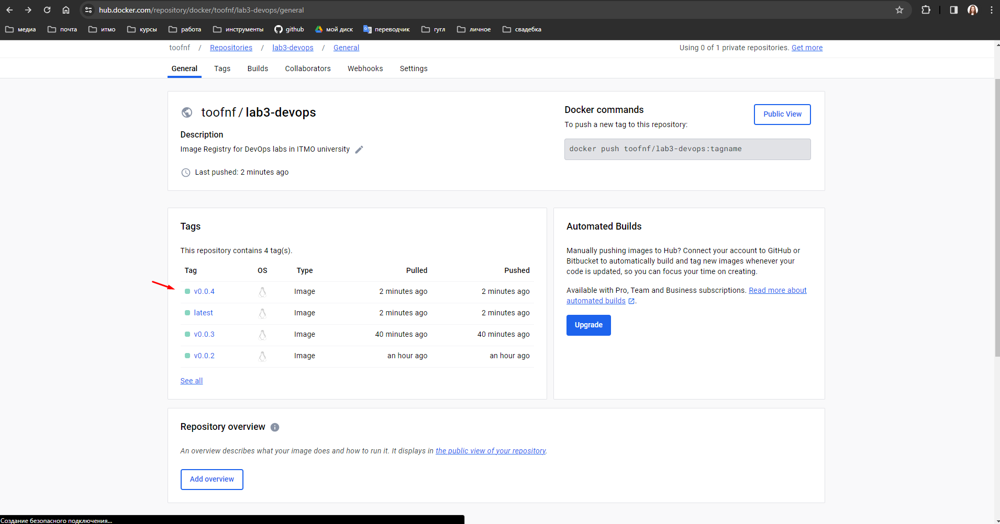

# Lab 3 - Docker Image Pushing

## Описание задания

Сделать, чтобы после пуша в ваш репозиторий автоматически собирался докер образ и результат его сборки сохранялся куда-нибудь. 

Например, если результат - текстовый файлик, он должен автоматически сохраниться на локальную машину или ваш сервер

## Решение

В данной работе было решено использовать следующий пайплайн выкатки нового релиза нашего приложения:

- разработчик пушит в `main` ветку некоторые изменения
- разработчик создаёт новый релиз приложения с помощью создания тэга
- запускается процесс пайплайна с помощью [Github Actions](https://docs.github.com/en/actions/using-workflows/about-workflows), который содержит следующие шаги:
  - получение тэга релиза
  - логин в общедоступный dockerhub
  - сборку образа 
  - пуш образа с соответствующим тэгом релиза и тэгом `latest`

Рассмотрим подробнее, что было сделано для реализации данного пайплайна. Сначала был создан аккаунт в [dockerhub](https://hub.docker.com/) и внутри создан репозиторий:


Затем в репозитории были созданы две секретные перемнные: `DOCKER_USERNAME` и `DOCKER_PASSWORD`


После этого, воспользовавшись документацией к [Github Actions](https://docs.github.com/en/actions/using-workflows/about-workflows) и отдельно докуметацией по [пушу образа](https://docs.github.com/en/actions/publishing-packages/publishing-docker-images),
был создан файл по пути `./.github/workflows/lab3-toofnf-docker.yml`, в котором содержится описание workflow, с помощью которого описанный выше пайплайн будет работать:

```yaml
name: lab3-docker-build-and-push-images
run-name: Pushing images to docker by @${{ github.actor }}

on:
  push:
    branches:
      - 'main'
    tags:
      - 'v*'
  workflow_dispatch:

jobs:
  docker-image-build-push:
    if: startsWith(github.ref, 'refs/tags/')
    name: Docker image build and push operations
    runs-on: ubuntu-latest
    steps:
    - uses: actions/checkout@v4
    - name: Set env
      run: echo "RELEASE_VERSION=${GITHUB_REF#refs/*/}" >> $GITHUB_ENV
    - name: Test
      run: |
        echo $RELEASE_VERSION
        echo ${{ env.RELEASE_VERSION }}
    - name: login to docker
      uses: docker/login-action@v3
      with:
        username: ${{ secrets.DOCKER_USERNAME }}
        password: ${{ secrets.DOCKER_PASSWORD }}
    - name: build-push-docker
      uses: docker/build-push-action@v5
      with:
        file: ./docker/Dockerfile
        push: true
        tags: ${{ secrets.DOCKER_USERNAME }}/lab3-devops:latest,${{ secrets.DOCKER_USERNAME }}/lab3-devops:${{ env.RELEASE_VERSION }}
```

В данном файле описан следующие правила построения `workflow`:

- название (name): `lab3-docker-build-and-push-images`
- название workflow: в CI будет выведен мой ник в github: `Pushing images to docker by @toofnf`
- пайплайн будет собираться лишь при пуше в `main` ветку (`branches: main`) и только при создании какого-то релиза в главной ветке с помощью тэга (любого тэга, подпадающего под regex `v*`). Это условие проверяется в строчке: `if: startsWith(github.ref, 'refs/tags/')`
- создатся одна джоба по имени `docker-image-build-push` с помощью раннера `ubuntu-latest` со следующими шагами внутри:
    - делает checkout на нужную ветку в нашей репе
    - в таске `Set env` в переменную [RELEASE_VERSION](https://stackoverflow.com/a/58178121) задаётся имя тэга, чтобы его можно было использовать в последующих шагах;
    - проверяем, что переменная действительно совпадает с тэгом релиза в джобе `Test`
    - в таске `login to docker` производится логин в `dockerhub` по нашим кредам, заданным в кредах
    - в таске `build-push-docker` используется репозиторий [build-push-action](https://github.com/docker/build-push-action?ysclid=lqh8p9lbis808921147) с описанием тагов (`latest` и `release_tag`), а также переменной `file`, в которой указывается путь к `Dockerfile`

Данный файл был запушен в репозиторий. Создадим тэг `v0.0.4`, чтобы активировать триггер пайплайна:


Пайплайн триггернулся, запустился и выполнился:


Посмотрим в dockerhub - видно, что новый image с тэгом `v0.0.4` добавился в dockerhub:



Теперь переведём dockerhub репозиторий в публичный репозиторий, скачаем наш image и используем его при запуске контейнера:

```
docker run --rm -it -p 9000:9000 toofnf/lab3-devops:v0.0.4
```


В результате мои образы можно скачать по данной ссылке в [dockerhub](https://hub.docker.com/r/toofnf/lab3-devops) и с помощью команды `docker pull toofnf/lab3-devops:latest`.
В задании был реализован процесс выкатки, сборки и пуша docker-контейнера по тэгу в main ветке, а значит лабораторная выполнена.