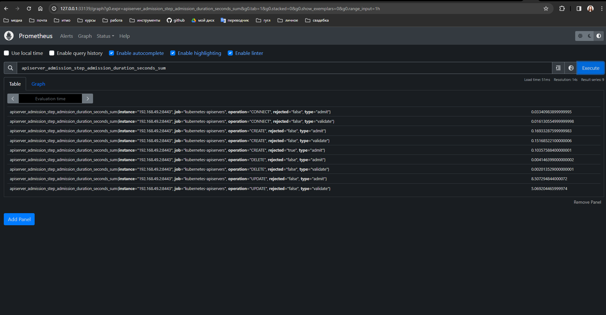
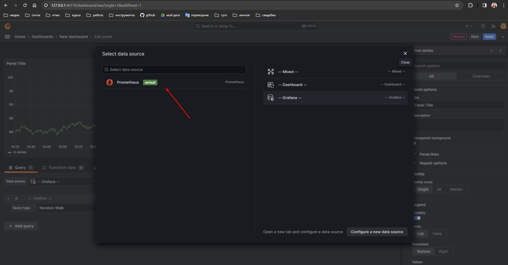

# Lab 4 - K8S Deployment Monitoring - Prometheus, Grafana

## Описание задания

Сделать мониторинг сервиса, поднятого в кубере (использовать, например, prometheus и grafana). 

Показать хотя бы два рабочих графика, которые будут отражать состояние системы.

## Решение

Из лабораторной работы 2 мы разобрались, как поднять наш написанный сервер с помощью [k8s](https://kubernetes.io/), а теперь нам предстоит настроить его мониторинг с помощью связки технологий - [prometheus](https://prometheus.io/) и [grafana](https://grafana.com/).
Prometheus представляет из себя технологию для мониторинга метрик приложений, написанных в специальном формате [openmetrics](https://prometheus.io/docs/instrumenting/exposition_formats/) со специального ендпоинта приложения (по дефолту используется путь `/metrics), а grafana предназначена для визуализации метрик из различных источников (prometheus является одним из частоупотребляемых).

Начнём с части, связанной с `prometheus`. Для того чтобы настроить мониторинг именно нашего приложения добавим 2 изменения в наше веб приложение:

1. Добавление библиотеки `prometheus-fastapi-instrumentator`, которая отвечает за сбор метрик по `web`-приложению (количество запросов, количество 5xx ошибок, время ответа сервис и многие другие). Добавляется она двумя стрчоками кода:

    ```python
    from fastapi import FastAPI
    from prometheus_fastapi_instrumentator import Instrumentator

    app = FastAPI()

    Instrumentator().instrument(app).expose(app)
    ```
   
    После добавления данных строчек кода у приложения помимо основных ендпоинтов появится ендпоинт `/metrics`, на котором будут указываться метрики приложения

    

2. Второе изменение связано с логикой ответа веб-сервиса для дальнейшне наглядной визуализации работы сборщика метрик - поменяем код приложения таким образом, чтобы с 25% вероятностью запрос к ендпоинту отрабатывал с ошибкой:

   ```python
   @app.get("/items/{item_id}")
   def read_item(item_id: int, q: str | None = None):
       d = random.choice([0, 1, 1, 1]) # выбираем с вероятностью 25 процентов неверный ответ
       if d == 0:
           raise HTTPException(status_code=500, detail="Ups.. random works here")
       return {"item_id": item_id, "q": q}
   ```
   
Наше приложение готово к работе - зальём последнюю версию приложения в репозиторий и на dockerhub, как это было сделано в 3-ей лабораторной.

Теперь перейдём непосредственно к `prometheus` и для установки данной технологии в `k8s` будем использовать сборщик пакетов `k8s` - [helm](https://helm.sh/), которые позволяет собирать `k8s` решения с помощью параметризованных `yml` конфигов. 
Для установки `helm` были выполнены следующие команды с помощью менеджера зависимостей библиотек [asdf](https://asdf-vm.com/):

```
asdf plugin add helm
asdf install helm 3.13.3
asdf global helm 3.13.3
```

Будем использовать уже написанные `helm chart`- в специальном репозитории - [prometheus helm charts](https://github.com/prometheus-community/helm-charts?ysclid=lqjpoehvhd213222725), в котором собрано очень много дополнительных компонент, которые могут потребоваться в дальнейшем при работе с `prometheus`.
Установим только один из них пока что - `prometheus`. 

Сначала добавим репозиторий с помощью команды:

```bash
helm repo add prometheus-community https://prometheus-community.github.io/helm-charts
```

Перед установкой релиза посмотрим, что вообще мы будем устанавливать в данном чарте. Это можно сделать, просмотрев `values` данного чарта и сохранив их в специальный файл - `./charts/prometheus/values.yml`:

```bash
helm show values prometheus-community/prometheus > ./charts/prometheus/values.yml
```

Посмотрев на данный файл можно заметить, что вместе с `prometheus` поднимаются ещё несколько сервисов, а именно:

- [prometheus-pushgateway] - насколько я понимаю, этот некоторый промежуточный сервис, в который можно пушить метрики, а данный `pushgateway` отправит их уже в базу данных `prometheus`
- [prometheus-node-exporter](https://prometheus.io/docs/guides/node-exporter/) - официальный экспортер метрик ноды, на которой развёрнуто приложение
- [kube-state-metrics](https://github.com/kubernetes/kube-state-metrics?ysclid=lqjpx413bo115714573) - это технология, в которой описано очень много дополнительных метрик, свойственных для абстракций `k8s`
- [alertmanager](https://prometheus.io/docs/alerting/latest/alertmanager/) - позволяет настраивать алерты в различные источники и на различные условия для метрик
- и сам главный сервис - prometheus-server

Данный файл `./charts/prometheus/values.yml` является настройкой для релиза и его можно менять, чтобы кастомизировать и настроить релиз prometheus-а так, как мы хотим. Например, вместо типа сервиса `ClusterIP` у `prometheus` добавим сервис `NodePort`:

```yml
prometheus-server:
  service:
    type: NodePort
    nodePort: 31848
```

Теперь попробуем создать первый релиз `prometheus`-а с помощью следующей команды, в которой мы устанавливаем релиз `prometheus`, берем базовую настройку из репозитория, который мы недавно добавили (`prometheus-community/prometheus`) и добавляем свои настройки (`-f ./charts/prometheus/values.yml`)

```bash
helm install prometheus prometheus-community/prometheus -f ./charts/prometheus/values.yml
```


Видимо, что всё успешно поднялось - поднялись все 5 подов, которые мы описали, крутится наше приложение, а так же тип сервиса у `prometheus-server` - NodePort с нужным подом.

```
NAME                                                     READY   STATUS    RESTARTS   AGE
pod/lab1-app-88987bdf8-bq8lv                             1/1     Running   0          6h37m
pod/prometheus-alertmanager-0                            1/1     Running   0          39m
pod/prometheus-kube-state-metrics-6b464f5b88-hmjjw       1/1     Running   0          39m
pod/prometheus-prometheus-node-exporter-7xw6x            1/1     Running   0          39m
pod/prometheus-prometheus-pushgateway-7857c44f49-mz5jh   1/1     Running   0          39m
pod/prometheus-server-6b68fbd54b-tpcww                   2/2     Running   0          39m

NAME                                          TYPE        CLUSTER-IP       EXTERNAL-IP   PORT(S)          AGE
service/kubernetes                            ClusterIP   10.96.0.1        <none>        443/TCP          40h
service/lab1-app                              NodePort    10.99.7.19       <none>        9000:31234/TCP   40h
service/prometheus-alertmanager               ClusterIP   10.99.73.41      <none>        9093/TCP         39m
service/prometheus-alertmanager-headless      ClusterIP   None             <none>        9093/TCP         39m
service/prometheus-kube-state-metrics         ClusterIP   10.102.9.110     <none>        8080/TCP         39m
service/prometheus-prometheus-node-exporter   ClusterIP   10.105.149.134   <none>        9100/TCP         39m
service/prometheus-prometheus-pushgateway     ClusterIP   10.99.35.145     <none>        9091/TCP         39m
service/prometheus-server                     NodePort    10.109.52.185    <none>        80:31848/TCP     39m

NAME                                                 DESIRED   CURRENT   READY   UP-TO-DATE   AVAILABLE   NODE SELECTOR            AGE
daemonset.apps/prometheus-prometheus-node-exporter   1         1         1       1            1           kubernetes.io/os=linux   39m

NAME                                                READY   UP-TO-DATE   AVAILABLE   AGE
deployment.apps/lab1-app                            1/1     1            1           40h
deployment.apps/prometheus-kube-state-metrics       1/1     1            1           39m
deployment.apps/prometheus-prometheus-pushgateway   1/1     1            1           39m
deployment.apps/prometheus-server                   1/1     1            1           39m

NAME                                                           DESIRED   CURRENT   READY   AGE
replicaset.apps/lab1-app-88987bdf8                             1         1         1       7h8m
replicaset.apps/prometheus-kube-state-metrics-6b464f5b88       1         1         1       39m
replicaset.apps/prometheus-prometheus-pushgateway-7857c44f49   1         1         1       39m
replicaset.apps/prometheus-server-6b68fbd54b                   1         1         1       39m

NAME                                       READY   AGE
statefulset.apps/prometheus-alertmanager   1/1     39m
```

Для того чтобы посмотреть в браузере на то, что поднялось, запустим команду `minikube service prometheus-server --url` и перейдем по ссылке (у меня это `http://127.0.0.1:33139`). 
В prometheus на главной странице можно искать метрики, которые в него попадают:



Что более важно, можно посмотреть, из каких источников prometheus забирает данные - это находится на странице `targets`:


Однако пока что мы не можем найти метрики с нашего приложения, например, метрику `http_requests_total` - она не отображается в `prometheus`-е. 
Для того чтобы добавить метрики из нашего пода, нам необходимо указать в `annotations` пода путь, по которому находится метрики (это `/metrics`), а также порт, на котором эти метрики собирать (совпадает с портом приложениея - 9000) - исправим файл `app.yaml` следующим образом:

```yaml
apiVersion: v1
kind: Service
metadata:
  name: lab1-app
  annotations:
    prometheus.io/scrape: 'true'
    prometheus.io/port: '9000'
    prometheus.io/path: '/metrics'
```

Накатив обновление с помощью `kubectl apply -f ./app.yaml` мы увидим, что, во-первых, появился новый таргет, у которого prometheus собирает метрики и он активен, а во-вторых (как следствие), что метрики приложения, которые мы хотели собирать в начале данной лабораторной, отображаются в prometheus!


Отлично, мониторинг метрик нашего приложения с помощью `prometheus` настроен. Теперь перейдём к визуализации метрик из `prometheus` с помощью `grafana`.

Для добавления `grafana` также скачаем `helm-chart` и установим его с помощью следующих команд:

```bash
helm repo add grafana https://grafana.github.io/helm-charts
helm show values grafana/grafana > ./charts/grafana/values.yml
helm install grafana grafana/grafana -f ./charts/grafana/values.yml
```


Как видно, grafana тоже успешно установилась, а в values не было внесено никаких изменений. Тут нас уведомляют о том, как войти в графану и с помощью каких user-password это сделать - если ввести указанные на рисунке выше команды, то получим, что пользователь, под которым нужно заходить - это `admin`, а пароль - `Z1y7XQFbKvZJaVEjXNZpXYEgpuAfUptPv6VjjksF`:

```bash
kubectl get secret --namespace default grafana -o jsonpath="{.data.admin-user}" | base64 --decode ; echo
kubectl get secret --namespace default grafana -o jsonpath="{.data.admin-password}" | base64 --decode ; echo
```

Для того чтобы посмотреть в браузере на то, что поднялась grafana, введём команду `minikube service grafana --url` и перейдем по ссылке (у меня это `http://127.0.0.1:46119`). 


Войдём с указанным юзером и паролем в `grafana` - вход был выполнен успешно:


Теперь нам необходимо создать дашборд и добавить источник данных, из которого мы будем брать метрики - это поднятый нами `prometheus`. 
Для этого зайдём по пути `Home->Dashboards->Create visualization->Add visualization->Configure a new data source`, и после этого нас перекинет на страницу с описанием нового ресурса - выберем `prometheus` и введём следующие настройки:

- `name`: `Prometheus`
- `host`: путь к `prometheus`, который был указан при деплое - `http://prometheus-server.default.svc.cluster.local`
- нажать на кнопку `save and test` - должна загореться зелёная кнопка с тем, что подключение источника прошло успешно:


Теперь при создании дашборда появляется данный источник в качестве `default` - будем использовать его:



Теперь создадим маленький дашборд - укажем в качестве метрики процент ошибочных ответов на определённой ручке нашего приложения, как отношение ошибочных запросов к общему числу запросов:

```
(1 - (sum(http_requests_total{status='2xx'}) by (handler)) / (sum(http_requests_total) by (handler))) * 100
```


А теперь в течение нескольких минут понагружаем наше приложение - позадаем вопросы по `url`-у `/items/1` с помощью библиотеки [locust](https://locust.io/) - мы ожидаем, что в 25 процентах случаях наше приложение будет падать с ошибкой 500.

Для этого создадим конфиг `./tests/config.py`, в котором опишем, что мы будем обращаться к ручке `/items/1` и запустим нагрузочное тестирование следующей командой:

```
pdm run locust -f tests/config.py --headless --run-time 720 --spawn-rate 10 --users 50 --host http://localhost:<node_port>
```

Спустя время видно, что график колебался, но пришёл в положение 25 процентов, а значит мы выбрали корректную метрику:


Добавим ещё количество обращений к каждому ендпоинту и получим миленький и достаточно информативаный дашборд:


Также дашборды можно импортировать - например, взять уже готовые - например, дашборд для [node exporter](https://grafana.com/oss/prometheus/exporters/node-exporter/), который можно импортировать, задав ID дашборда:


В результате данной лабораторной был настроен мониторинг приложения с помощью `prometheus`, а также выполнена визуализация мониторинга приложения с помощью `grafana`, а значит лабораторная работа выполнена.
